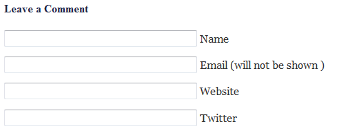

# Twitter Avatar Reloaded #
**Contributors:** sudar   
**Tags:** twitter, gravatar, avatar  
**Requires at least:** 3.8  
**Donate Link:** http://sudarmuthu.com/if-you-wanna-thank-me  
**Tested up to:** 3.9.1  
**Stable tag:** 2.0  

Stores Twitter username together with comments and replaces gravatar with twitter avatar.

## Description ##

Twitter avatar reloaded Plugin adds a new field to the comment form to get the user's Twitter username and stores it together with comments and using it replaces gravatar with twitter avatar when the comment is displayed.

This Plugin works seamlessly and you don't need to edit your theme files to add the new field to the comment form. It automatically adds it when activated.

**Note: Because of the changes in the way Twitter API works, from v2.0 of the plugin you need to create a twitter app and provide the access key and token. Refer to the installation instructions to find out how to do this**

### Template functions

This Plugin provides 7 template functions which you can use in your theme to customize the way the comment author's twitter id/profile should be displayed.

*   `get_comment_author_twitter_id($comment_id)` - Get the Twitter id of the comment author
*   `comment_author_twitter_id($comment_id)` - Print the Twitter id of the comment author
*   `get_comment_author_twitter_url($comment_id)` - Get the Twitter profile url of the comment author
*   `comment_author_twitter_url($comment_id)` - Print the Twitter url of the comment author
*   `get_comment_author_twitter_profile_image($comment_id)` - Get the twitter profile image url of the comment author
*   `comment_author_twitter_profile_image($comment_id)` - Print the twitter profile image url of the comment author
*   `get_twitter_profile_image($twitter_username)` - Get the twitter profile image of a user using twitter id

### Styling using CSS

By default the Plugin uses the class `comment-form-twitter` for the new twitter field. You can add CSS to that field or you can change the class in the Plugins setting page.

### Development

The development of the Plugin happens over at [github][6]. If you want to contribute to the Plugin, fork the [project at github][6] and send me a pull request.

If you are not familiar with either git or Github then refer to this [guide to see how fork and send pull request](http://sudarmuthu.com/blog/contributing-to-project-hosted-in-github).

### Support

- If you have found a bug/issue or have a feature request, then post them in [github issues][7]
- If you have a question about usage or need help to troubleshoot, then post in WordPress forums or leave a comment in [Plugins's home page][1]
- If you like the Plugin, then kindly leave a review/feedback at [WordPress repo page][8].
- If you find this Plugin useful or and wanted to say thank you, then there are ways to [make me happy](http://sudarmuthu.com/if-you-wanna-thank-me) :) and I would really appreciate if you can do one of those.
- Checkout other [WordPress Plugins][5] that I have released.
- If anything else, then contact me in [twitter][3].

 [1]: http://sudarmuthu.com/wordpress/twitter-avatar-reloaded
 [3]: http://twitter.com/sudarmuthu
 [4]: http://sudarmuthu.com/blog
 [5]: http://sudarmuthu.com/wordpress
 [6]: https://github.com/sudar/twitter-avatar-reloaded
 [7]: https://github.com/sudar/twitter-avatar-reloaded/issues
 [8]: http://wordpress.org/extend/plugins/twitter-avatar-reloaded/

### Credit

This plugin uses [wp-twitter-api](https://github.com/timwhitlock/wp-twitter-api) by @[timwhitlock](https://twitter.com/timwhitlock) as the underlying backend to make calls to Twitter.

## Translation ##

*   Hebrew (Thanks Sagive)
*   Dutch (Thanks Rene of WordPress WPwebshop)
*   Brazilian Portuguese (Thanks Marcelo of Criacao de Sites em Ribeirao Preto)
*   German (Thanks Jenny Beelens)
*   Spanish (Thanks Brian Flores of InMotion Hosting)
*   Bulgarian (Thanks Nikolay Nikolov of Health Blog)
*   Lithuanian (Thanks Vincent G)
*   Hindi (Thanks Love Chandel)
*   Serbian (Thanks Diana)
*   Irish (Thanks Vikas Arora)
*   Gujarati (Thanks Puneet)

The pot file is available with the Plugin. If you are willing to do translation for the Plugin, use the pot file to create the .po files for your language and let me know. I will add it to the Plugin after giving credit to you.

## Installation ##

Extract the zip file and just drop the contents in the wp-content/plugins/ directory of your WordPress installation and then activate the Plugin from Plugins page.

Once the plugin is installed and enabled you can bind it to a Twitter account as follows:

- Register a Twitter application at https://dev.twitter.com/apps
- Note the Consumer key and Consumer secret under OAuth settings
- Log into WordPress admin and go to Settings > Twitter API
- Enter the consumer key and secret and click 'Save settings'
- Click the 'Connect to Twitter' button and follow the prompts.

## Screenshots ##

Comment form with the new Twitter Field

## Readme Generator ##

This Readme file was generated using <a href = "http://sudarmuthu.com/wordpress/wp-readme">wp-readme</a>, which generates readme files for WordPress Plugins.
